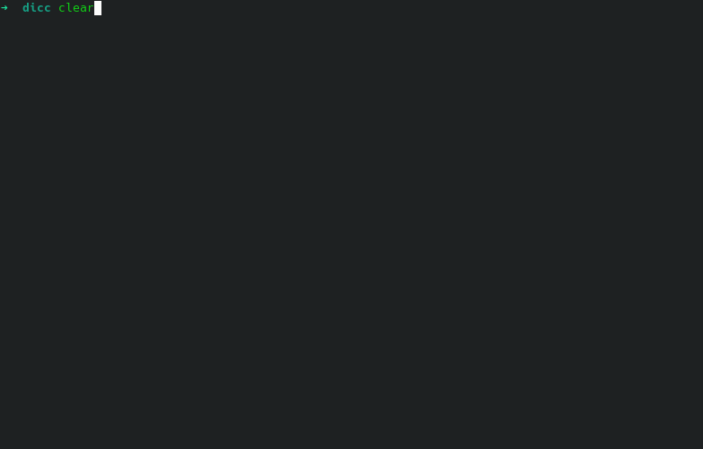

# Description

The landsat2geojson package is written in python and uses the [EarthExplorer](https://earthexplorer.usgs.gov/)
and [Overpass](https://overpass-turbo.eu/)  portal interface to search, download, and process scenes from Landsat
Collections via the command line.

# Requirements

landsat2geojson uses the [landsatxplore](https://github.com/yannforget/landsatxplore) package to connect and download
the landsat images, the credentials can be obtained in  [Earth Explorer Page](https://ers.cr.usgs.gov/register/)

`--username` and `--password` can be provided as command-line options or as environment variables:


```sh 
export LANDSATXPLORE_USERNAME=<your_username>
export LANDSATXPLORE_PASSWORD=<your_password>
```

# Installation
## repository
the installation from the repository 

```sh 
git clone https://github.com/yunica/landsat2geojson.git
cd landsat2geojson
pip install .

```
## docker
build

```sh
export LANDSATXPLORE_USERNAME=<your_username>
export LANDSATXPLORE_PASSWORD=<your_password>

docker-compose build 
```
run

```shell
docker run  --rm -v ${PWD}:/mnt \
  -e LANDSATXPLORE_USERNAME=$LANDSATXPLORE_USERNAME \
  -e LANDSATXPLORE_PASSWORD=$LANDSATXPLORE_PASSWORD \
  landsat2geojson:v1 \
  landsat2geojson --geojson_file=test.geojson --data_folder=data/ --geojson_output=data/salida123.geojson  

```
# Usage


## help
you can review the parameters menu with the param `--help`
```sh
landsat2geojson --help
```
```sh
Usage: landsat2geojson [OPTIONS]

Options:
  -u, --username TEXT     EarthExplorer username.
  -p, --password TEXT     EarthExplorer password.
  --geojson_file TEXT     Pathfile from geojson input  [required]
  --data_folder TEXT      Path from download data
  --lansat_index [WATER]  Landsar normalized index
  --geojson_output TEXT   Pathfile from geojson output  [required]
  --help                  Show this message and exit.
```

### example

```sh
landsat2geojson --geojson_file=area.geojson   --data_folder=data/  --geojson_output=data/output_data.geojson     
```


